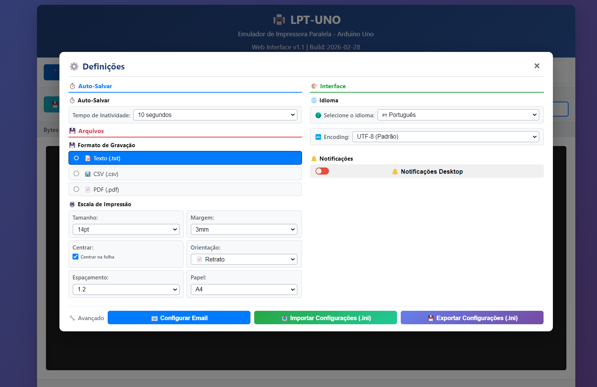
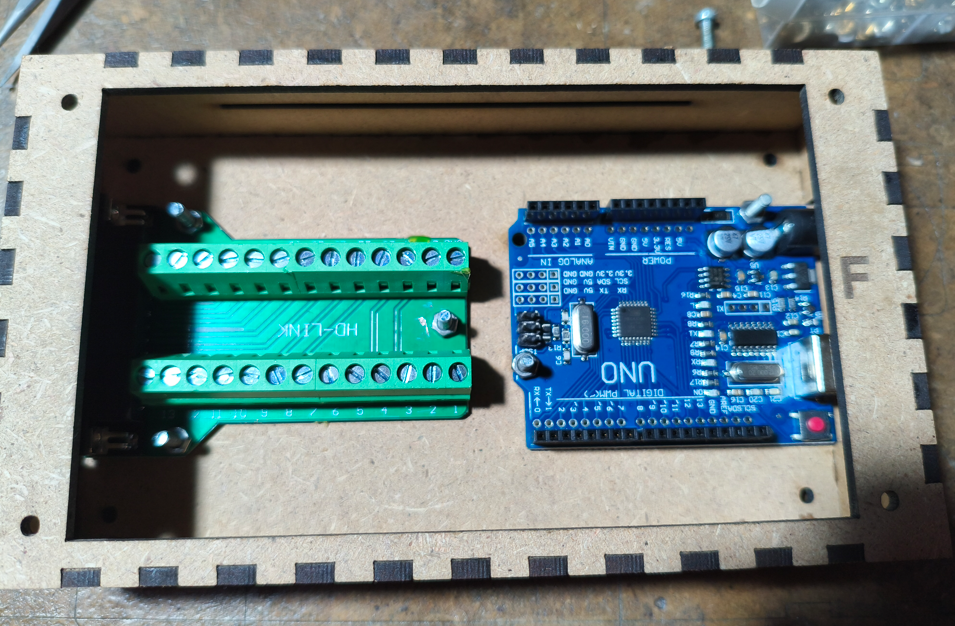

# LPT-UNO - Parallel Port Printer Emulator

[](https://www.arduino.cc/)
[]()
[]()
[]()

Transform your Arduino Uno into a **parallel port printer emulator (LPT/DB25)** that receives data through the parallel interface and forwards it via USB Serial to your PC for visualization and printing in a modern web browser with advanced features.

You no longer need to keep your parallel printer running!!

Perfect for reviving old DOS applications, legacy software testing, or educational purposes!

---

<p align="center">
  
  
</p>

<p align="center">
  
  
</p>

## 📸 Features Overview

- ✅ **Full IEEE 1284 compatibility** (parallel port standard)
- ✅ **Web-based interface** with real-time data visualization
- ✅ **Auto-print control via .bat files** (Ativar_AutoPrint.bat / Desativar_AutoPrint.bat)
- ✅ **Multi-language support** (English, Portuguese, Spanish)
- ✅ **Auto-save functionality** (saves every 10 seconds)
- ✅ **One-click launcher** (.bat file for Windows)
- ✅ **Hardware interrupts** (<2µs response time)
- ✅ **256-byte circular buffer** for reliable data handling

---

## 🎯 Quick Start


### Recommended: Automatic Flow (Windows)

1. To enable auto-print: **Run `Ativar_AutoPrint.bat`**
2. To disable auto-print: **Run `Desativar_AutoPrint.bat`**
3. Both scripts open the web interface and enable automatic printing (see the **Auto-Print** section for details).

### Manual Mode (advanced)
1. Open **`web_interface.html`** in Chrome, Edge, or Opera
2. Click "Connect to Arduino"
3. Select the COM port
4. Save files manually and move them to `DATA` to print if desired

---

## 🔌 Hardware Setup

### Components Needed

- **1x Arduino Uno R3** (ATmega328P)
- **1x DB25 Female Connector**
- **Jumper wires** (male-to-male or male-to-female)
- **Breadboard** (optional)
- **USB cable** (Type A to Type B for Arduino)

### Pinout

See `PINOUT.txt` for full DB25 diagrams and wiring.

Key points:
- **STROBE**: DB25 Pin 1 → Arduino Digital 2 (INT0) — must use hardware interrupt on pin 2.
- **Data pins**: DB25 Pins 2–9 → Arduino Digital 3–10 (D0 → D7)
- **Control pins**: ACK → D11, BUSY → D12, SELECT → D13
- **Ground**: DB25 Pins 18–25 → Arduino GND (connect all)
Pin 13 (SELECT)   <--   Digital 13 (LED indicator)
Pin 18-25 (GND)   ---   GND (all grounds together)
```

### ⚠️ Important Notes

- **STROBE must be on Pin 2**: Arduino Uno only has hardware interrupts on pins 2 and 3 (INT0/INT1). The STROBE signal MUST be connected to pin 2 (INT0) for the emulator to work!
- **Voltage levels**: LPT uses 5V TTL logic (compatible with Arduino Uno)
- **Do NOT use** 3.3V Arduinos without level shifters
- **Cable length**: Keep cables < 2 meters to avoid noise
- **Ground connection**: Connect **ALL** ground pins (18-25) to Arduino GND

---

## 💻 Software Installation

### Step 1: Upload Arduino Firmware

1. Download or clone this repository
2. Open **`LPT_Emulator/LPT_Emulator.ino`** in Arduino IDE
3. Select **Tools → Board → Arduino Uno**
4. Select **Tools → Port → [Your COM Port]**
5. Click **Upload** (or press Ctrl+U)
6. Wait for "Done uploading" message

### Step 2: Test the Connection

Open the Serial Monitor in Arduino IDE (Tools → Serial Monitor):
- Set baud rate to **115200**
- Type `V` and press Enter to see firmware version
- Type `?` for help and available commands

### Step 3: Launch Web Interface

#### Windows Users (Recommended)
- Double-click **`LPT-UNO.bat`** for instant startup with auto-print mode

#### Manual Method
- Open **`web_interface.html`** in Chrome, Edge, or Opera
- Click "Connect to Arduino" button
- Select the Arduino COM port from the list
- Start receiving data!

---

## 🎨 Web Interface Features

### Main Controls

| Button | Function |
|--------|----------|
| **Connect to Arduino** | Opens Web Serial connection dialog |
| **Disconnect** | Closes serial connection |
| **Clear** | Clears the output buffer (keeps connection active) |
| **Save Now** | Downloads received data as a text file |

### Encoding Support

Choose the correct encoding for your data source:
- **UTF-8 (Default)** - Default, works with modern systems and Arduino UTF-8 strings
- **ISO-8859-1 (Latin)** - For legacy systems and DOS/Windows Latin characters
- **CP-437 (DOS)** - For DOS applications and old PCs with extended ASCII
- **Windows-1252** - For Windows legacy applications

The encoding selector is located in the top control bar. The web interface automatically reconnects when you change the encoding.


### Languages

Switch between:
- 🇬🇧 English
- 🇵🇹 Português (Portuguese)
- 🇪🇸 Español (Spanish)

### Auto-Save Feature

- Automatically saves received data every **10 seconds** of inactivity
- Files are named: `LPT_Output_YYYY-MM-DD_HH-MM-SS.txt`
- Prevents data loss if browser crashes


### Auto-Print (Automatic Printing)

Auto-print is now controlled externally:
- **Enable auto-print:** Run `Ativar_AutoPrint.bat` (creates the `.autoprint_enabled` file in the `DATA` folder)
- **Disable auto-print:** Run `Desativar_AutoPrint.bat` (removes the `.autoprint_enabled` file)
- The PowerShell script `LPT-UNO_MoveToData.ps1` moves files from the Downloads folder to `DATA` and only prints if `.autoprint_enabled` exists
- The browser no longer controls automatic printing

---

## 📡 Communication Protocol

### IEEE 1284 Compatibility Mode

The emulator implements the standard parallel port protocol:

1. **PC places data** on D0-D7 pins
2. **PC activates STROBE** (HIGH → LOW transition)
3. **Arduino detects STROBE** via hardware interrupt
4. **Arduino activates BUSY** (indicates processing)
5. **Arduino reads data** from all 8 pins
6. **Arduino stores data** in 256-byte circular buffer
7. **Arduino sends ACK** (~5µs LOW pulse)
8. **Arduino deactivates BUSY** (ready for next byte)
9. **Arduino forwards data** via USB Serial in main loop

### Timing Specifications

| Parameter | Value | Notes |
|-----------|-------|-------|
| **STROBE detection** | < 2 µs | Hardware interrupt response |
| **BUSY activation** | ~10 µs | Processing time |
| **ACK pulse width** | ~5 µs | Standard LPT timing |
| **Maximum throughput** | ~100 kB/s | Theoretical limit |
| **Serial baud rate** | 115200 | Maximum for Arduino Uno |

---

## 🛠️ Arduino Serial Commands

Type these commands in the Serial Monitor (115200 baud):

| Command | Action | Response |
|---------|--------|----------|
| **`V`** or **`v`** | Show version info | Firmware version + build date |
| **`S`** or **`s`** | Show statistics | Buffer usage (X/256 bytes) |
| **`R`** or **`r`** | Reset buffer | Clears internal buffer |
| **`?`** | Help | Lists all available commands |

### Example Session

```
> V
Firmware Version: 1.0
Build Date: Jan 25 2026 14:30:00

> S
Buffer usage: 42/256 bytes

> R
Buffer reset
```

---

## 🚀 Advanced Usage


### Silent Printing (Windows)

Use the auto-print scripts (`Ativar_AutoPrint.bat` / `Desativar_AutoPrint.bat`) to enable/disable automatic printing; see the **Auto-Print** section for details.

### Custom Printer Selection

To print to a specific printer (not default):
1. Open browser settings
2. Set your desired printer as default
3. Launch the application with the `.bat` file

### Testing Without Hardware

You can test the web interface without Arduino:
1. Open `web_interface.html` directly in browser
2. Use the "Simulate Test Data" feature (developer mode)
3. Or modify the HTML to add test data injection

---

## 📁 Project Structure

```
LPT-UNO/
│
├── LPT_Emulator/
│   └── LPT_Emulator.ino          # Arduino firmware (v1.0)
│
├── web_interface.html             # Web-based monitor (v1.0)
├── Ativar_AutoPrint.bat           # Enables auto-print and opens the interface
├── Desativar_AutoPrint.bat        # Disables auto-print and opens the interface
├── LPT-UNO_AutoPrint_Direct.bat   # Main launcher (opens interface and monitor)
├── LPT-UNO_MoveToData.ps1         # PowerShell script: moves and prints files
├── PINOUT.txt                     # Detailed pinout diagram (ASCII art)
├── README.md                      # This file
├── .gitignore                     # Git ignore rules
└── .github/
    └── copilot-instructions.md    # Project coding guidelines
```

---

## 🐛 Troubleshooting

### Arduino doesn't respond
- ✅ Check USB cable connection
- ✅ Verify correct COM port in Arduino IDE
- ✅ Press Arduino reset button
- ✅ Re-upload the firmware

### Web interface can't connect
- ✅ Use **Chrome, Edge, or Opera** (Web Serial API required)
- ✅ Close other applications using the serial port
- ✅ Refresh the page and try again
- ✅ Check browser console for error messages (F12)

### No data received
- ✅ Verify all wiring connections (especially GND)
- ✅ Check STROBE is connected to pin 2 (interrupt)
- ✅ Ensure data pins D0-D7 are in correct order
- ✅ Test with Arduino Serial Monitor first

### Troubleshooting: Auto-print not working
- ✅ Always use the `.bat` files to enable/disable auto-print
- ✅ Check that the `.autoprint_enabled` file exists in the `DATA` folder
- ✅ Ensure a default printer is configured in Windows
- ✅ Make sure the printer is online and has paper

### Characters are garbled
- ✅ Check for loose wire connections
- ✅ Reduce cable length (<2 meters)
- ✅ Verify correct pinout (D0 = LSB, D7 = MSB)
- ✅ Ensure all GND pins (18-25) are connected

---

## 🔧 Technical Specifications

### Hardware
- **Microcontroller**: ATmega328P (Arduino Uno)
- **Input pins**: 9 (8 data + 1 interrupt)
- **Output pins**: 3 (ACK, BUSY, SELECT)
- **Buffer size**: 256 bytes (circular)
- **Response time**: < 2 µs (interrupt-driven)

### Software
- **Firmware version**: 1.0
- **Web interface version**: 1.0
- **Build date**: 2026-01-25
- **Serial speed**: 115200 baud
- **Encoding**: UTF-8
- **Monitoring and printing**: via LPT-UNO_MoveToData.ps1

### Compatibility
- **Arduino boards**: Uno R3, Uno R4 (5V variants)
- **Browsers**: Chrome 89+, Edge 89+, Opera 76+
- **Operating systems**: Windows 10/11, Linux, macOS
- **Protocols**: IEEE 1284 compatibility mode

---

## 📝 Development Guidelines

### Version Control

**Always update** when modifying code:

#### Arduino Firmware
```cpp
#define FIRMWARE_VERSION "X.Y"  // Increment on changes
#define BUILD_DATE __DATE__     // Auto-updated on compile
```

#### Web Interface
```html
<p id="firmwareInfo">Web Interface v1.0 | Build: 2026-01-25</p>
```

### Encoding (development)
- Prefer **UTF-8** for all source files and user-facing text. The web UI supports selectable encodings (UTF-8 default; CP‑437 is available for DOS-era content).

### Code Style
- **Comments**: Portuguese (for this project)
- **Variable names**: English (standard practice)
- **User-facing text**: Multi-language support

---

## 🤝 Contributing

Contributions are welcome! Please:

1. Fork this repository
2. Create a feature branch (`git checkout -b feature/AmazingFeature`)
3. Commit your changes (`git commit -m 'Add AmazingFeature'`)
4. Push to the branch (`git push origin feature/AmazingFeature`)
5. Open a Pull Request

### Ideas for Contributions
- Support for other Arduino boards (Mega, Due, etc.)
- Bidirectional communication (EPP/ECP modes)
- Mobile-friendly web interface
- Additional printer emulation modes
- Linux/macOS launcher scripts
- Automated testing suite

---

## 📜 License

This project is licensed under the **MIT License** - see below for details:

```
MIT License

Copyright (c) 2026 LPT-UNO Project

Permission is hereby granted, free of charge, to any person obtaining a copy
of this software and associated documentation files (the "Software"), to deal
in the Software without restriction, including without limitation the rights
to use, copy, modify, merge, publish, distribute, sublicense, and/or sell
copies of the Software, and to permit persons to whom the Software is
furnished to do so, subject to the following conditions:

The above copyright notice and this permission notice shall be included in all
copies or substantial portions of the Software.

THE SOFTWARE IS PROVIDED "AS IS", WITHOUT WARRANTY OF ANY KIND, EXPRESS OR
IMPLIED, INCLUDING BUT NOT LIMITED TO THE WARRANTIES OF MERCHANTABILITY,
FITNESS FOR A PARTICULAR PURPOSE AND NONINFRINGEMENT. IN NO EVENT SHALL THE
AUTHORS OR COPYRIGHT HOLDERS BE LIABLE FOR ANY CLAIM, DAMAGES OR OTHER
LIABILITY, WHETHER IN AN ACTION OF CONTRACT, TORT OR OTHERWISE, ARISING FROM,
OUT OF OR IN CONNECTION WITH THE SOFTWARE OR THE USE OR OTHER DEALINGS IN THE
SOFTWARE.
```

---

## 🙏 Acknowledgments

- **IEEE 1284 Standard** for parallel port specifications
- **Web Serial API** for enabling browser-hardware communication
- **Arduino Community** for extensive documentation and support
- **DOS/Legacy Software Enthusiasts** for keeping retro computing alive

---

## 📞 Support

- **Issues**: [GitHub Issues](https://github.com/nasp2000/lpt-uno/issues)
- **Discussions**: [GitHub Discussions](https://github.com/nasp2000/lpt-uno/discussions)
- **Documentation**: See `PINOUT.txt` for detailed wiring diagrams

---

## 🌟 Star This Project

If you find this project useful, please give it a ⭐ on GitHub!

---

**Made with ❤️ for the retro computing community**

*Last updated: January 25, 2026 | Version 1.0*
