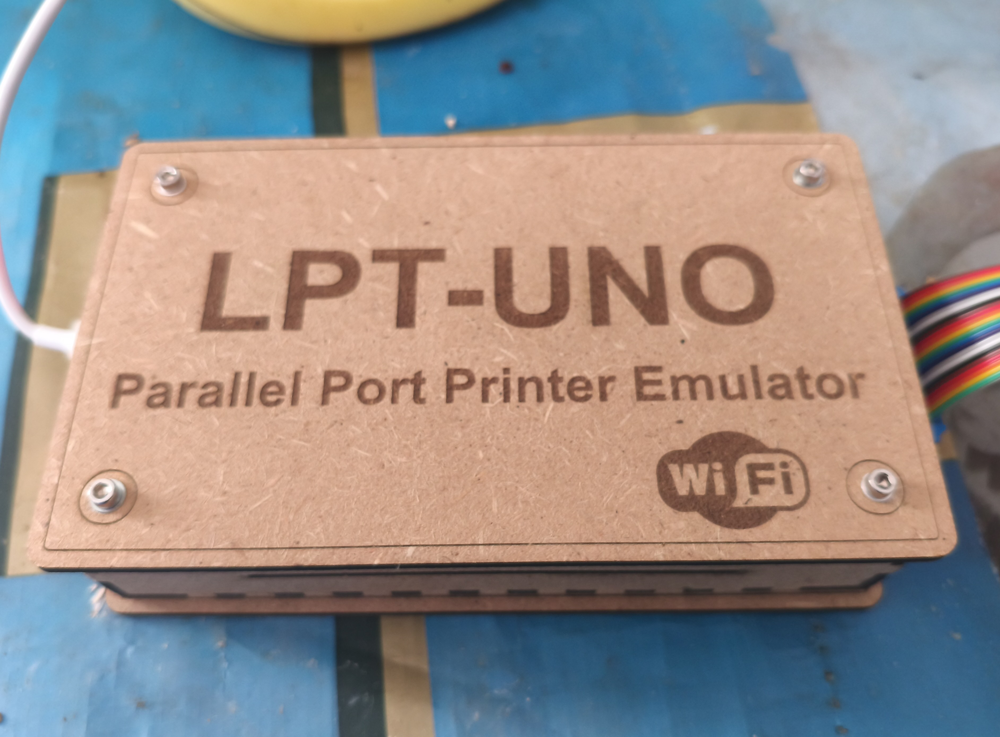
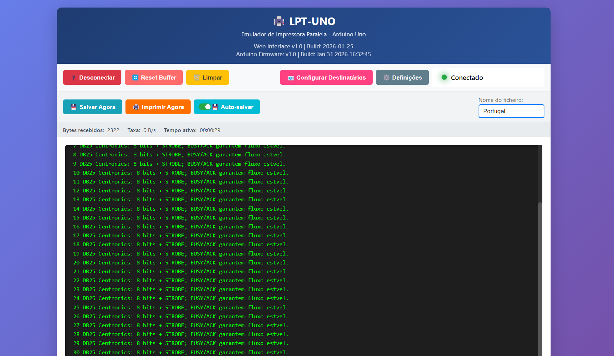
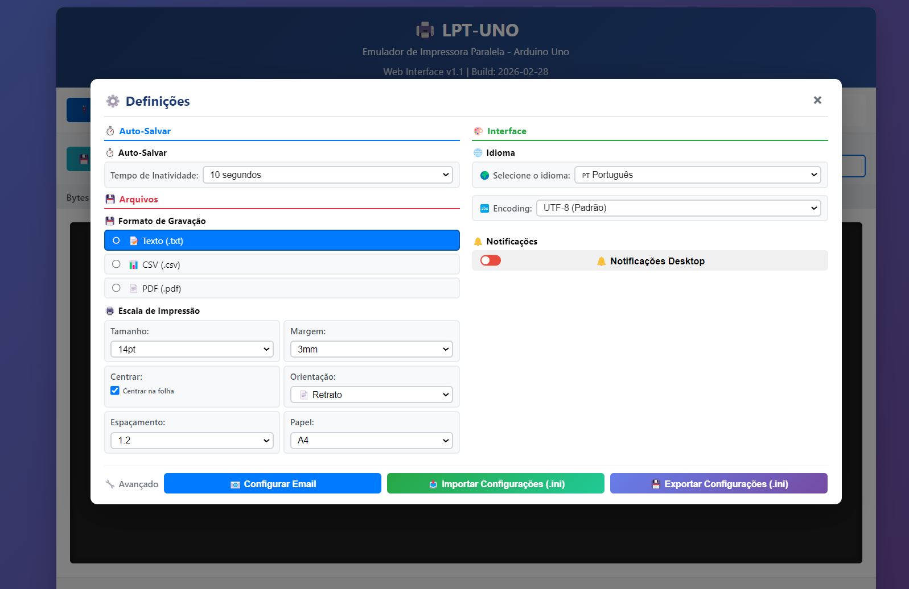
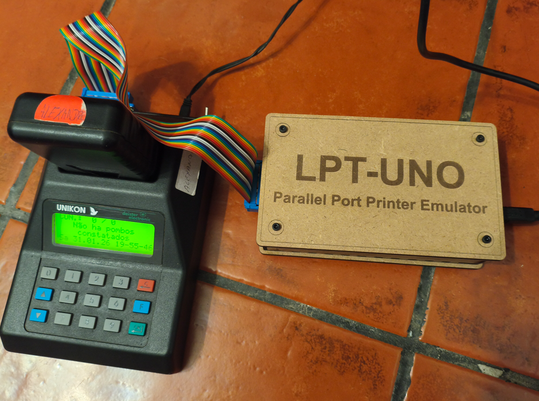

# LPT-UNO — Parallel Port Printer Emulator

Turn an Arduino Uno into a **LPT/DB25 parallel port emulator**. Data received via the parallel interface is forwarded over USB Serial (or WiFi on R4) to a browser-based interface for real-time visualization and printing.

> No parallel printer required. Works with old DOS apps, legacy software, and educational setups.

  
  

  
  

---

## Quick Start

1. Upload **LPT_Emulator/LPT_Emulator.ino** via Arduino IDE (115200 baud).
2. Open **web_interface.html** in Chrome or Edge.
3. Click **Connect** and select the Arduino COM port.

---

## Wiring (DB25 → Arduino)

| DB25 | Arduino | Signal |
|------|---------|--------|
| 1 | D2 | STROBE (INT0) |
| 2–9 | D3–D10 | D0–D7 (data) |
| 10 | D11 | ACK |
| 11 | D12 | BUSY |
| 13 | D13 | SELECT |
| 18–25 | GND | Ground |

> Use **5V TTL** levels only. See [PINOUT.txt](PINOUT.txt) for full diagram.

---

## Arduino Uno R4 WiFi

The R4 WiFi is fully supported with the same wiring. To use WiFi:

1. Upload the firmware to the Uno R4 WiFi.
2. Open **web_interface.html**, go to **Settings → WiFi** and enter your network credentials (SSID and password).
3. Click **Connect** — the interface discovers the board automatically or you can enter the IP manually.

| | Uno R3 | Uno R4 WiFi |
|---|---|---|
| CPU | ATmega328P 16 MHz | RA4M1 48 MHz |
| RAM | 2 KB | 32 KB |
| Connectivity | USB | USB + WiFi |

---

## Serial Commands

| Command | Action |
|---------|--------|
| `V` | Firmware version |
| `S` | Buffer usage |
| `R` | Reset buffer |
| `?` | Help |

---

## Troubleshooting

- **No connection:** check COM port, reset board, re-upload firmware.
- **No data:** verify STROBE is on pin D2, check wiring and GND.
- **Garbled text:** try CP‑437 encoding (DOS apps) in the web interface.
- **WiFi not found:** confirm credentials, check Serial Monitor for IP.

---

## License

MIT © 2026 LPT-UNO Project
